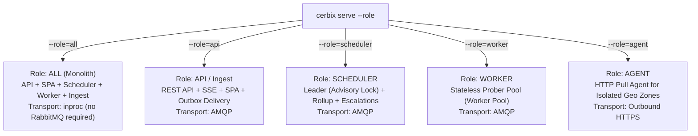
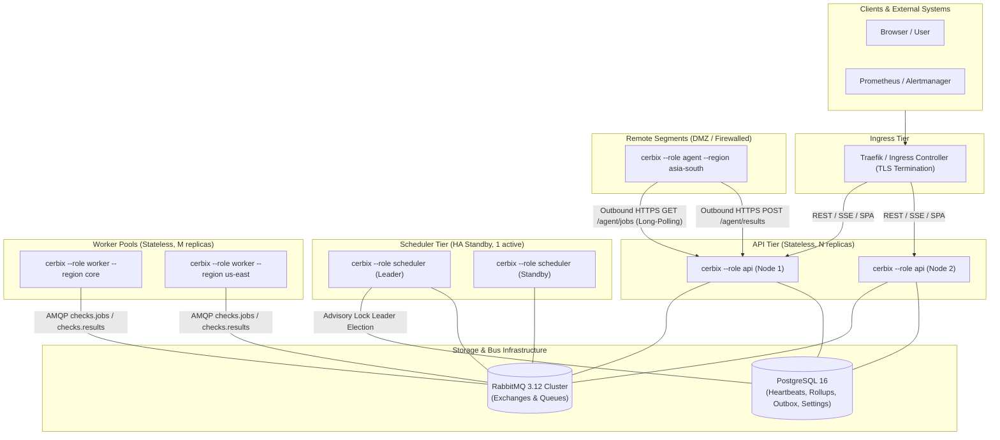
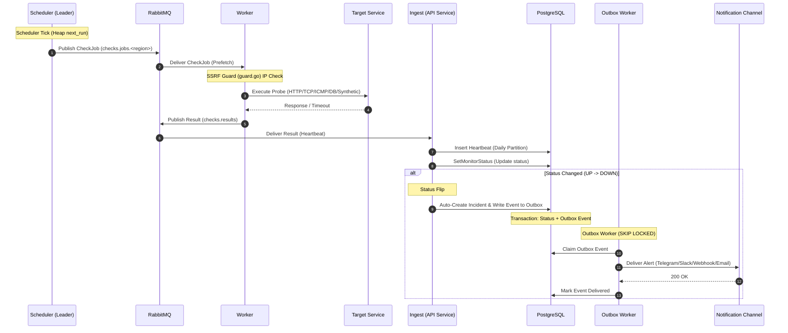
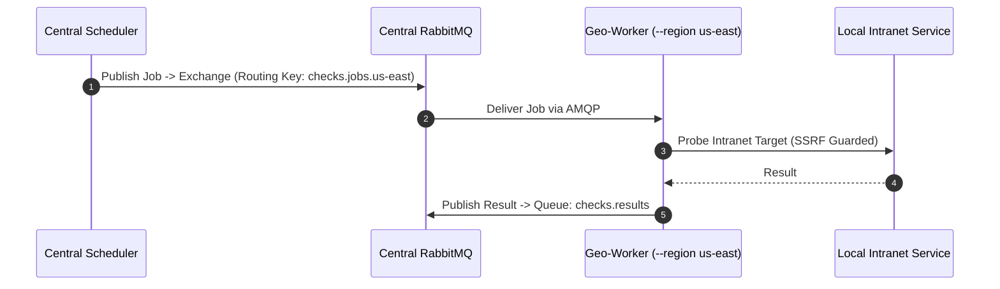
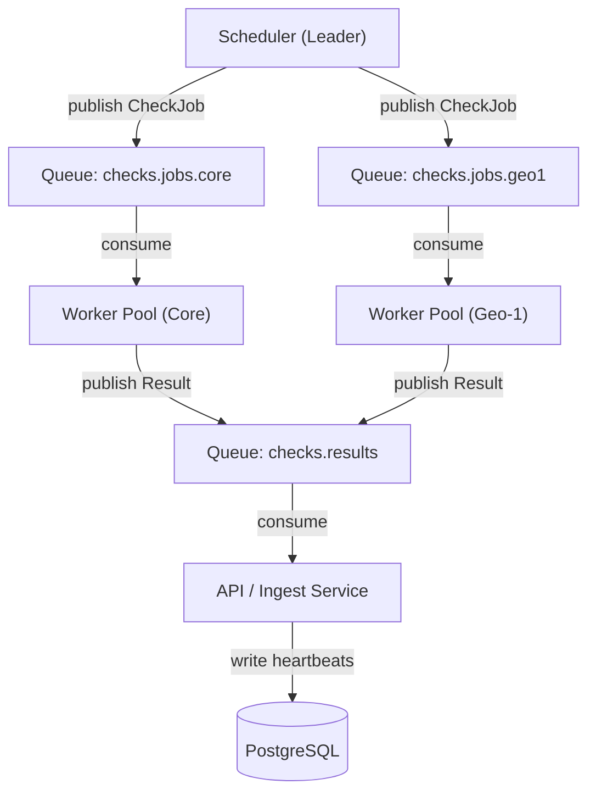
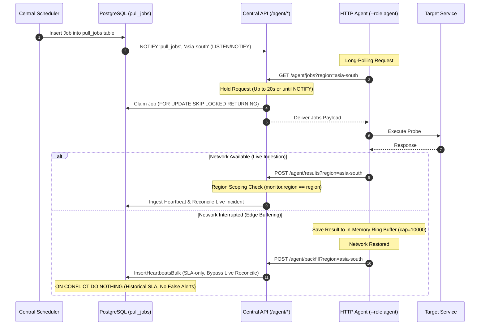
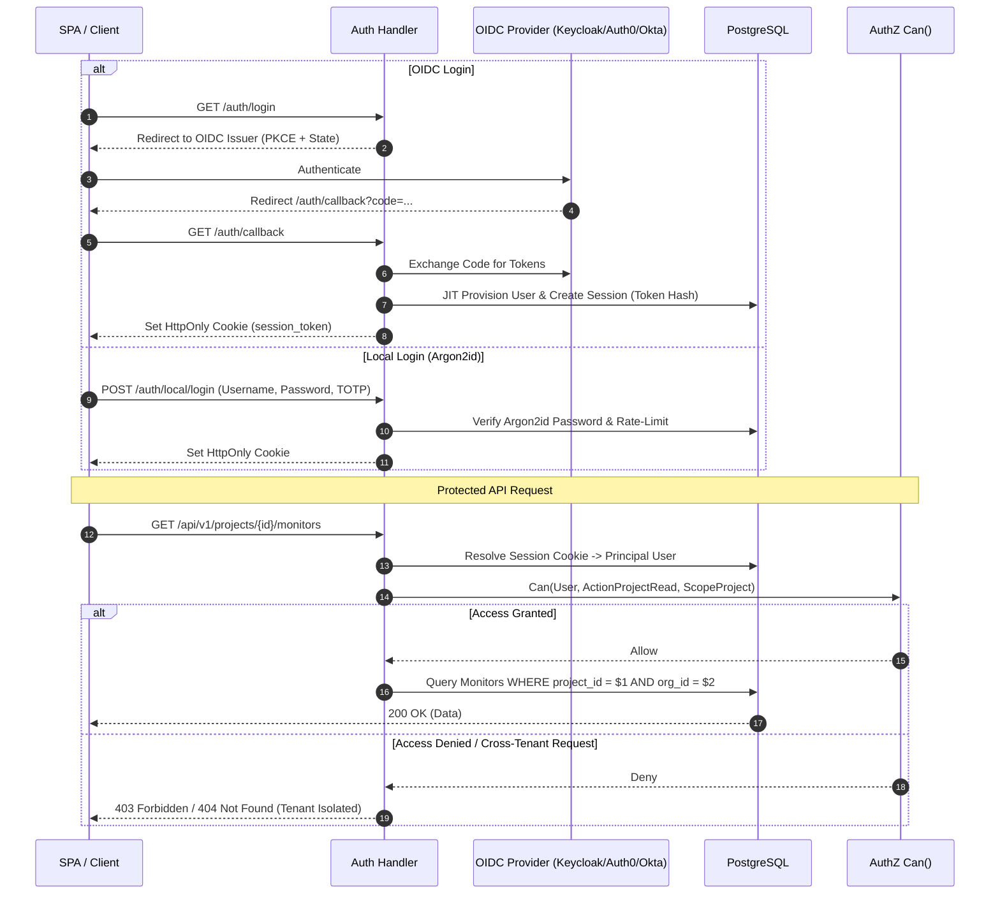
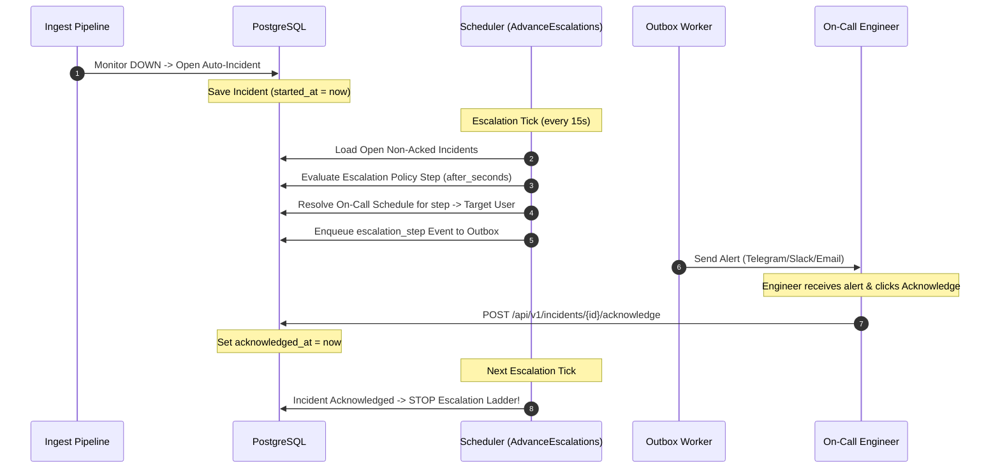
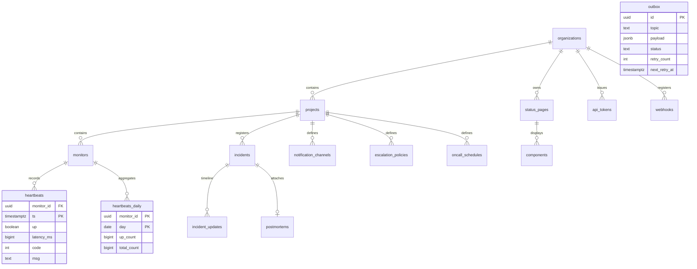

# cerbix — System Architecture & Workflow Diagrams

This document provides a comprehensive breakdown of the **cerbix** architecture, system components, data flows, sequence diagrams, and module interactions.

---

## 📐 1. Single Binary Concept & Process Roles

`cerbix` ships as a single compiled Go static binary with embedded database migrations and embedded Vue 3 SPA frontend assets ([`internal/web`](../internal/web)).

Process behavior is determined by the `--role` flag:

---

## 🏗️ 2. Distributed System Topology

In production, roles are deployed as independent, horizontally scalable containers.

---

## 🔄 3. Monitoring Execution Lifecycle (Main Data Flow)

Below is the sequence diagram illustrating a regular check execution (from scheduling to alert delivery):

---

## 🌍 4. Geo-Distributed Monitoring Architecture

### 4.1 Mode A: AMQP Geo-Worker Pools (Direct AMQP Connection)

### 💡 4.2 Data Flow via RabbitMQ Queues

The diagram below details the exact queue topology and data flow across RabbitMQ in AMQP mode:

### 4.3 Mode B: HTTP Pull-Agent (Outbound HTTPS Only)

---

## 🔐 5. Authentication & Tenant Authorization (AuthN & AuthZ)

---

## 🚨 6. Escalations, On-Call & Incident Handling

---

## 🗄️ 7. Database Entity-Relationship Diagram & Partitioning

* **Partitioning**: Table `heartbeats` is daily RANGE-partitioned (`RANGE PARTITION BY (ts)`). The leader scheduler automatically creates upcoming partitions and drops old ones according to `retention_days`.
* **Daily Rollup**: Aggregates in `heartbeats_daily` are calculated in the background by the scheduler leader to serve instantaneous 90+ day SLA/SLI reports.

