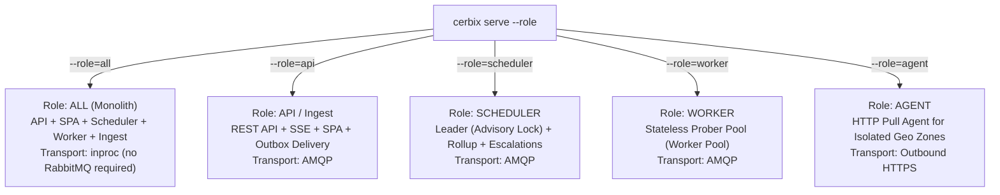
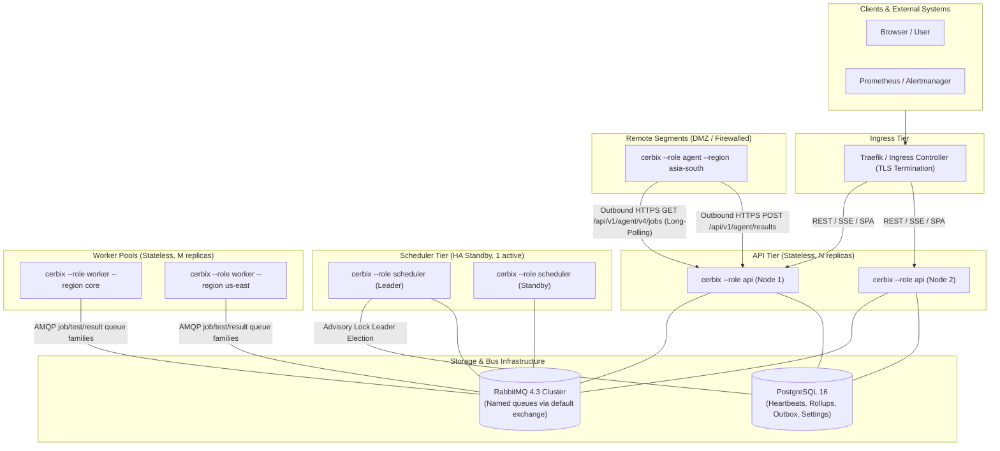
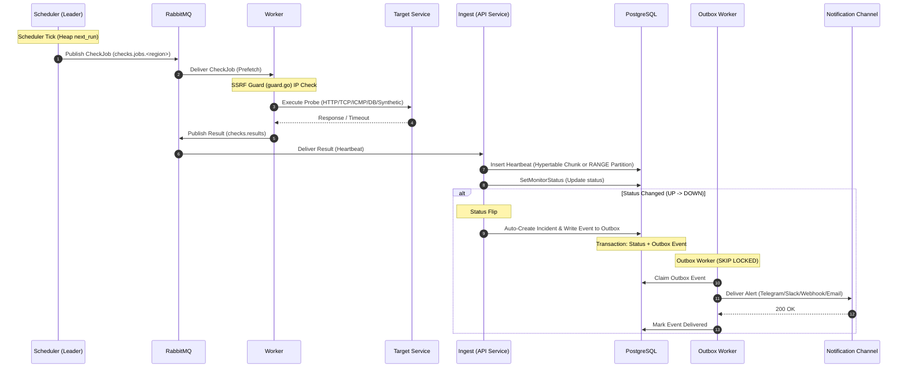
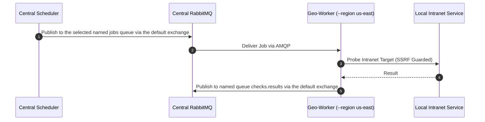
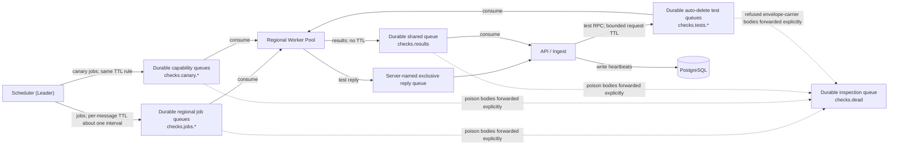
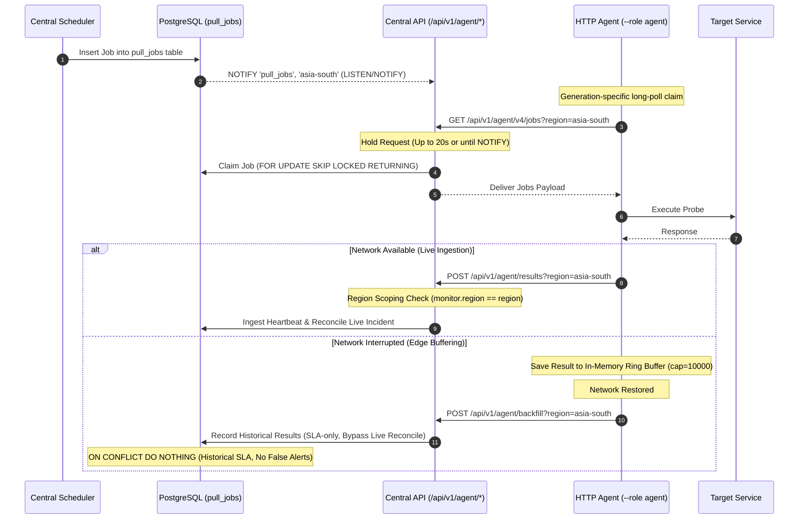
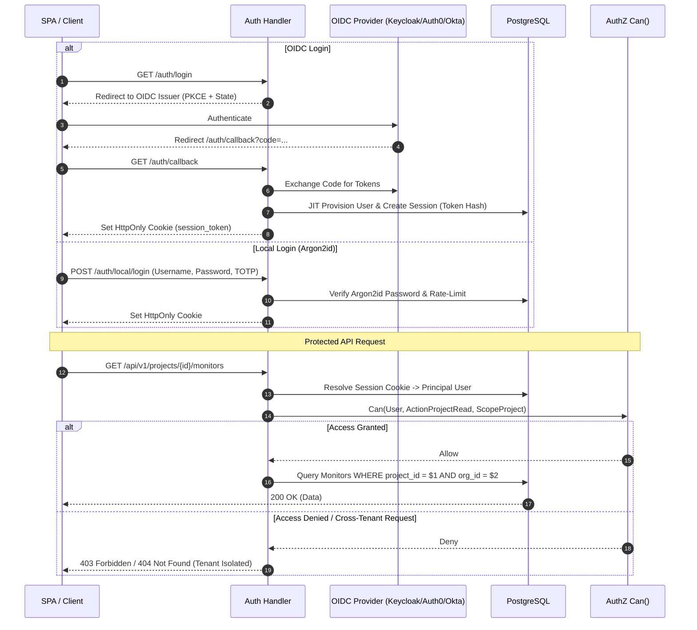
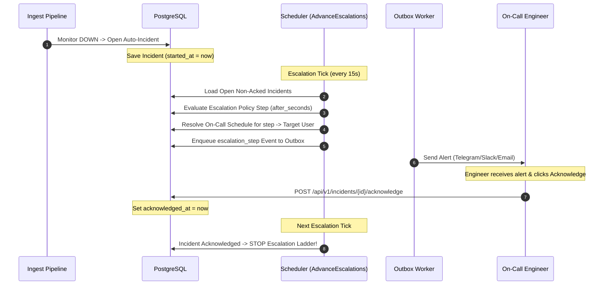

# cerbix — System Architecture & Workflow Diagrams

This document provides a comprehensive breakdown of the **cerbix** architecture, system components, data flows, sequence diagrams, and module interactions.

---

## 📐 1. Single Binary Concept & Process Roles

`cerbix` ships as a single compiled Go static binary with embedded database migrations and embedded Vue 3 SPA frontend assets ([`internal/web`](../internal/web)).

Process behavior is determined by the `--role` flag:

```mermaid
flowchart TD
    CLI["cerbix serve --role <role>"]
    
    CLI -->|--role=all| ALL["Role: ALL (Monolith)<br/>API + SPA + Scheduler + Worker + Ingest<br/>Transport: inproc (no RabbitMQ required)"]
    CLI -->|--role=api| API["Role: API / Ingest<br/>REST API + SSE + SPA + Outbox Delivery<br/>Transport: AMQP"]
    CLI -->|--role=scheduler| SCHED["Role: SCHEDULER<br/>Leader (Advisory Lock) + Rollup + Escalations<br/>Transport: AMQP"]
    CLI -->|--role=worker| WRK["Role: WORKER<br/>Stateless Prober Pool (Worker Pool)<br/>Transport: AMQP"]
    CLI -->|--role=agent| AGT["Role: AGENT<br/>HTTP Pull Agent for Isolated Geo Zones<br/>Transport: Outbound HTTPS"]
```

---

## 🏗️ 2. Distributed System Topology

In production, roles are deployed as independent, horizontally scalable containers.

```mermaid
flowchart TB
    subgraph Clients["Clients & External Systems"]
        User["Browser / User"]
        Prom["Prometheus / Alertmanager"]
    end

    subgraph IngressTier["Ingress Tier"]
        LB["Traefik / Ingress Controller (TLS Termination)"]
    end

    subgraph APITier["API Tier (Stateless, N replicas)"]
        API1["cerbix --role api (Node 1)"]
        API2["cerbix --role api (Node 2)"]
    end

    subgraph SchedTier["Scheduler Tier (HA Standby, 1 active)"]
        SCH1["cerbix --role scheduler (Leader)"]
        SCH2["cerbix --role scheduler (Standby)"]
    end

    subgraph WorkerTier["Worker Pools (Stateless, M replicas)"]
        W1["cerbix --role worker --region core"]
        W2["cerbix --role worker --region us-east"]
    end

    subgraph RemoteGeo["Remote Segments (DMZ / Firewalled)"]
        AGT1["cerbix --role agent --region asia-south"]
    end

    subgraph InfraTier["Storage & Bus Infrastructure"]
        MQ[("RabbitMQ 4.3 Cluster<br/>(Named queues via default exchange)")]
        PG[("PostgreSQL 16<br/>(Heartbeats, Rollups, Outbox, Settings)")]
    end

    Clients --> LB
    LB -->|REST / SSE / SPA| API1
    LB -->|REST / SSE / SPA| API2

    API1 & API2 --- MQ
    API1 & API2 --- PG

    SCH1 ---|Advisory Lock Leader Election| PG
    SCH1 & SCH2 --- MQ

    W1 & W2 ---|AMQP job/test/result queue families| MQ

    AGT1 -->|"Outbound HTTPS GET /api/v1/agent/v4/jobs (Long-Polling)"| API1
    AGT1 -->|Outbound HTTPS POST /api/v1/agent/results| API1
```

---

## 🔄 3. Monitoring Execution Lifecycle (Main Data Flow)

Below is the sequence diagram illustrating a regular check execution (from scheduling to alert delivery):

```mermaid
sequenceDiagram
    autonumber
    participant S as Scheduler (Leader)
    participant MQ as RabbitMQ
    participant W as Worker
    participant T as Target Service
    participant I as Ingest (API Service)
    participant DB as PostgreSQL
    participant OB as Outbox Worker
    participant N as Notification Channel

    Note over S: Scheduler Tick (Heap next_run)
    S->>MQ: Publish CheckJob (checks.jobs.<region>)
    MQ->>W: Deliver CheckJob (Prefetch)
    
    Note over W: SSRF Guard (guard.go) IP Check
    W->>T: Execute Probe (HTTP/TCP/ICMP/DB/Synthetic)
    T-->>W: Response / Timeout
    
    W->>MQ: Publish Result (checks.results)
    MQ->>I: Deliver Result (Heartbeat)
    
    I->>DB: Insert Heartbeat (Hypertable Chunk or RANGE Partition)
    I->>DB: SetMonitorStatus (Update status)
    
    alt Status Changed (UP -> DOWN)
        Note over I: Status Flip
        I->>DB: Auto-Create Incident & Write Event to Outbox
        Note over DB: Transaction: Status + Outbox Event
        
        Note over OB: Outbox Worker (SKIP LOCKED)
        OB->>DB: Claim Outbox Event
        OB->>N: Deliver Alert (Telegram/Slack/Webhook/Email)
        N-->>OB: 200 OK
        OB->>DB: Mark Event Delivered
    end
```

---

## 🌍 4. Geo-Distributed Monitoring Architecture

### 4.1 Mode A: AMQP Geo-Worker Pools (Direct AMQP Connection)

```mermaid
sequenceDiagram
    autonumber
    participant S as Central Scheduler
    participant MQ as Central RabbitMQ
    participant GW as Geo-Worker (--region us-east)
    participant Target as Local Intranet Service

    S->>MQ: Publish to the selected named jobs queue via the default exchange
    MQ->>GW: Deliver Job via AMQP
    GW->>Target: Probe Intranet Target (SSRF Guarded)
    Target-->>GW: Result
    GW->>MQ: Publish to named queue checks.results via the default exchange
```

### 💡 4.2 RabbitMQ Queue Families (Simplified)

cerbix publishes directly to named queues through RabbitMQ's default exchange (`exchange=""`,
the queue name as the routing key). It does not declare an application topic exchange or a
routing-key binding contract. The diagram is intentionally family-level; the canonical and
versioned queue names live in [`internal/dispatch/amqp.go`](../internal/dispatch/amqp.go).

```mermaid
flowchart LR
    SCHED["Scheduler (Leader)"]
    API["API / Ingest"]
    WORKER["Regional Worker Pool"]

    JOBS["Durable regional job queues<br/>checks.jobs.*"]
    CANARY["Durable capability queues<br/>checks.canary.*"]
    TESTS["Durable auto-delete test queues<br/>checks.tests.*"]
    REPLY["Server-named exclusive reply queue"]
    RESULTS["Durable shared queue<br/>checks.results"]
    DEAD["Durable inspection queue<br/>checks.dead"]
    PG[("PostgreSQL")]

    SCHED -->|jobs; per-message TTL about one interval| JOBS
    SCHED -->|canary jobs; same TTL rule| CANARY
    API -->|test RPC; bounded request TTL| TESTS
    JOBS & CANARY -->|consume| WORKER
    TESTS -->|consume| WORKER
    WORKER -->|test reply| REPLY
    REPLY --> API
    WORKER -->|results; no TTL| RESULTS
    RESULTS -->|consume| API
    API -->|write heartbeats| PG
    JOBS & CANARY & RESULTS -. poison bodies forwarded explicitly .-> DEAD
    TESTS -. refused envelope-carrier bodies forwarded explicitly .-> DEAD
```

| Family | Current named queues | Lifecycle and routing fact |
| --- | --- | --- |
| Scheduled jobs | `checks.jobs.<region>`, `checks.jobs.v2.<region>`, `checks.jobs.v3.<region>`, `checks.jobs.v4.<region>` | Durable regional queues. The selected carrier generation follows executor capability; each job has a per-message TTL of approximately its monitor interval. |
| Async canary jobs | `checks.canary.<kind>@<version>.<region>`, `checks.canary.v3.<kind>@<version>.<region>` | Durable regional capability queues. An executor announces support by consuming the queue; jobs use the same interval-based TTL rule. |
| Test Connection | `checks.tests.<region>`, `checks.tests.v2.<region>`, `checks.tests.v3.<region>` | Durable, auto-delete regional request queues. Each RPC request has a bounded TTL and replies through a server-named, non-durable, exclusive, auto-delete queue. |
| Results | `checks.results` | Durable shared queue with no result TTL; slow ingest must not discard valid results. |
| Dead letter inspection | `checks.dead` | Durable shared queue. cerbix explicitly forwards poison job/result bodies and refused envelope-carrier test bodies; this is not a broker exchange/DLX contract. |

### 4.3 Mode B: HTTP Pull-Agent (Outbound HTTPS Only)

```mermaid
sequenceDiagram
    autonumber
    participant S as Central Scheduler
    participant DB as PostgreSQL (pull_jobs)
    participant API as Central API (/api/v1/agent/*)
    participant AG as HTTP Agent (--role agent)
    participant Target as Target Service

    S->>DB: Insert Job into pull_jobs table
    DB-->>API: NOTIFY 'pull_jobs', 'asia-south' (LISTEN/NOTIFY)
    
    Note over AG: Generation-specific long-poll claim
    AG->>API: GET /api/v1/agent/v4/jobs?region=asia-south
    Note over API: Hold Request (Up to 20s or until NOTIFY)
    API->>DB: Claim Job (FOR UPDATE SKIP LOCKED RETURNING)
    API-->>AG: Deliver Jobs Payload
    
    AG->>Target: Execute Probe
    Target-->>AG: Response
    
    alt Network Available (Live Ingestion)
        AG->>API: POST /api/v1/agent/results?region=asia-south
        Note over API: Region Scoping Check (monitor.region == region)
        API->>DB: Ingest Heartbeat & Reconcile Live Incident
    else Network Interrupted (Edge Buffering)
        Note over AG: Save Result to In-Memory Ring Buffer (cap=10000)
        Note over AG: Network Restored
        AG->>API: POST /api/v1/agent/backfill?region=asia-south
        API->>DB: Record Historical Results (SLA-only, Bypass Live Reconcile)
        Note over DB: ON CONFLICT DO NOTHING (Historical SLA, No False Alerts)
    end
```

The sequence shows the generation-4 job claim used by a ledger-capable current agent. The agent
selects the highest route it can consume and falls back across compatible generations during a
rolling upgrade. The complete HTTP-pull surface registered by `AgentRouter` is:

| Purpose | Method and route |
| --- | --- |
| Job claims, carrier generations 1–4 | `GET /api/v1/agent/jobs`, `GET /api/v1/agent/v2/jobs`, `GET /api/v1/agent/v3/jobs`, `GET /api/v1/agent/v4/jobs` |
| Live results and historical edge-buffer replay | `POST /api/v1/agent/results`, `POST /api/v1/agent/backfill` |
| Test Connection claims, carrier generations 1–3 | `GET /api/v1/agent/tests`, `GET /api/v1/agent/v2/tests`, `GET /api/v1/agent/v3/tests` |
| Test Connection result | `POST /api/v1/agent/test-results` |
| Liveness and capability announcement | `POST /api/v1/agent/heartbeat` |

---

## 🔐 5. Authentication & Tenant Authorization (AuthN & AuthZ)

```mermaid
sequenceDiagram
    autonumber
    participant Client as SPA / Client
    participant Auth as Auth Handler
    participant IdP as OIDC Provider (Keycloak/Auth0/Okta)
    participant DB as PostgreSQL
    participant AuthZ as AuthZ Can()

    alt OIDC Login
        Client->>Auth: GET /auth/login
        Auth-->>Client: Redirect to OIDC Issuer (PKCE + State)
        Client->>IdP: Authenticate
        IdP-->>Client: Redirect /auth/callback?code=...
        Client->>Auth: GET /auth/callback
        Auth->>IdP: Exchange Code for Tokens
        Auth->>DB: JIT Provision User & Create Session (Token Hash)
        Auth-->>Client: Set HttpOnly Cookie (session_token)
    else Local Login (Argon2id)
        Client->>Auth: POST /auth/local/login (Username, Password, TOTP)
        Auth->>DB: Verify Argon2id Password & Rate-Limit
        Auth-->>Client: Set HttpOnly Cookie
    end

    Note over Client, AuthZ: Protected API Request
    Client->>Auth: GET /api/v1/projects/{id}/monitors
    Auth->>DB: Resolve Session Cookie -> Principal User
    Auth->>AuthZ: Can(User, ActionProjectRead, ScopeProject)
    
    alt Access Granted
        AuthZ-->>Auth: Allow
        Auth->>DB: Query Monitors WHERE project_id = $1 AND org_id = $2
        DB-->>Client: 200 OK (Data)
    else Access Denied / Cross-Tenant Request
        AuthZ-->>Auth: Deny
        Auth-->>Client: 403 Forbidden / 404 Not Found (Tenant Isolated)
    end
```

---

## 🚨 6. Escalations, On-Call & Incident Handling

```mermaid
sequenceDiagram
    autonumber
    participant Ingest as Ingest Pipeline
    participant DB as PostgreSQL
    participant Sched as Scheduler (AdvanceEscalations)
    participant Outbox as Outbox Worker
    participant User as On-Call Engineer

    Ingest->>DB: Monitor DOWN -> Open Auto-Incident
    Note over DB: Save Incident (started_at = now)

    Note over Sched: Escalation Tick (every 15s)
    Sched->>DB: Load Open Non-Acked Incidents
    Sched->>DB: Evaluate Escalation Policy Step (after_seconds)
    Sched->>DB: Resolve On-Call Schedule for step -> Target User
    Sched->>DB: Enqueue escalation_step Event to Outbox

    Outbox->>User: Send Alert (Telegram/Slack/Email)
    
    Note over User: Engineer receives alert & clicks Acknowledge
    User->>DB: POST /api/v1/incidents/{id}/acknowledge
    Note over DB: Set acknowledged_at = now
    
    Note over Sched: Next Escalation Tick
    Sched->>DB: Incident Acknowledged -> STOP Escalation Ladder!
```

---

## 🗄️ 7. Database Entity-Relationship Diagram & Partitioning

* **Adaptive raw storage**: when TimescaleDB is installed, `heartbeats` is a hypertable with one-day chunks created on demand, native compression after seven days, and retention through `drop_chunks`. On plain PostgreSQL it uses declarative daily `RANGE (ts)` partitions plus `heartbeats_default`; the leader creates dated partitions, drops fully expired ones, and deletes expired rows stranded in the DEFAULT partition.
* **Heartbeat identity**: raw rows are idempotent under `UNIQUE (monitor_id, ts)`; `ts` is not a standalone primary key. `observed_at` keeps the raw probe/client observation time separately from the effective ordering timestamp `ts`.
* **Daily Rollup**: the scheduler leader maintains `heartbeats_daily` with `up` and `total` counts. The rollup schema and query semantics are the same in both raw-storage modes.

```mermaid
erDiagram
    organizations ||--o{ projects : contains
    projects ||--o{ monitors : contains
    projects ||--o{ incidents : registers
    projects ||--o{ notification_channels : defines
    projects ||--o{ escalation_policies : defines
    projects ||--o{ oncall_schedules : defines

    monitors ||--o{ heartbeats : records
    monitors ||--o{ heartbeats_daily : aggregates

    incidents ||--o{ incident_updates : timeline
    incidents ||--o| postmortems : attaches

    organizations ||--o{ status_pages : owns
    status_pages ||--o{ components : displays

    organizations ||--o{ api_tokens : issues
    organizations ||--o{ webhooks : registers

    heartbeats {
        uuid monitor_id FK "part of UNIQUE(monitor_id, ts)"
        timestamptz ts "part of UNIQUE(monitor_id, ts)"
        timestamptz observed_at "nullable raw observation time"
        boolean up
        bigint latency_ms
        int code
        text msg
    }

    heartbeats_daily {
        uuid monitor_id PK
        date day PK
        bigint up
        bigint total
    }

    outbox {
        uuid id PK
        text topic
        jsonb payload
        text status
        int retry_count
        timestamptz next_retry_at
    }
```
