# cerbix — System Architecture & Workflow Diagrams

This document provides a comprehensive breakdown of the **cerbix** architecture, system components, data flows, sequence diagrams, and module interactions.

---

## 📐 1. Single Binary Concept & Process Roles

`cerbix` ships as a single compiled Go static binary with embedded database migrations and embedded Vue 3 SPA frontend assets ([`internal/web`](../internal/web)).

Process behavior is determined by the `--role` flag:

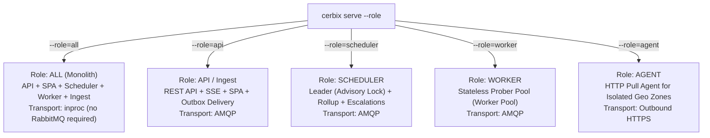
```mermaid
flowchart TD
    CLI["cerbix serve --role <role>"]
    
    CLI -->|--role=all| ALL["Role: ALL (Monolith)<br/>API + SPA + Scheduler + Worker + Ingest<br/>Transport: inproc (no RabbitMQ required)"]
    CLI -->|--role=api| API["Role: API / Ingest<br/>REST API + SSE + SPA + Outbox Delivery<br/>Transport: AMQP"]
    CLI -->|--role=scheduler| SCHED["Role: SCHEDULER<br/>Leader (Advisory Lock) + Rollup + Escalations<br/>Transport: AMQP"]
    CLI -->|--role=worker| WRK["Role: WORKER<br/>Stateless Prober Pool (Worker Pool)<br/>Transport: AMQP"]
    CLI -->|--role=agent| AGT["Role: AGENT<br/>HTTP Pull Agent for Isolated Geo Zones<br/>Transport: Outbound HTTPS"]
```

---

## 🏗️ 2. Distributed System Topology

In production, roles are deployed as independent, horizontally scalable containers.

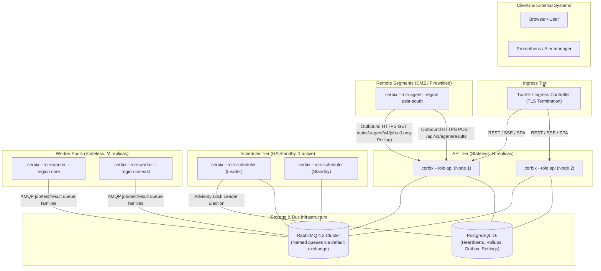
```mermaid
flowchart TB
    subgraph Clients["Clients & External Systems"]
        User["Browser / User"]
        Prom["Prometheus / Alertmanager"]
    end

    subgraph IngressTier["Ingress Tier"]
        LB["Traefik / Ingress Controller (TLS Termination)"]
    end

    subgraph APITier["API Tier (Stateless, N replicas)"]
        API1["cerbix --role api (Node 1)"]
        API2["cerbix --role api (Node 2)"]
    end

    subgraph SchedTier["Scheduler Tier (HA Standby, 1 active)"]
        SCH1["cerbix --role scheduler (Leader)"]
        SCH2["cerbix --role scheduler (Standby)"]
    end

    subgraph WorkerTier["Worker Pools (Stateless, M replicas)"]
        W1["cerbix --role worker --region core"]
        W2["cerbix --role worker --region us-east"]
    end

    subgraph RemoteGeo["Remote Segments (DMZ / Firewalled)"]
        AGT1["cerbix --role agent --region asia-south"]
    end

    subgraph InfraTier["Storage & Bus Infrastructure"]
        MQ[("RabbitMQ 4.3 Cluster<br/>(Named queues via default exchange)")]
        PG[("PostgreSQL 16<br/>(Heartbeats, Rollups, Outbox, Settings)")]
    end

    Clients --> LB
    LB -->|REST / SSE / SPA| API1
    LB -->|REST / SSE / SPA| API2

    API1 & API2 --- MQ
    API1 & API2 --- PG

    SCH1 ---|Advisory Lock Leader Election| PG
    SCH1 & SCH2 --- MQ

    W1 & W2 ---|AMQP job/test/result queue families| MQ

    AGT1 -->|"Outbound HTTPS GET /api/v1/agent/v4/jobs (Long-Polling)"| API1
    AGT1 -->|Outbound HTTPS POST /api/v1/agent/results| API1
```

---

## 🔄 3. Monitoring Execution Lifecycle (Main Data Flow)

Below is the sequence diagram illustrating a regular check execution (from scheduling to alert delivery):

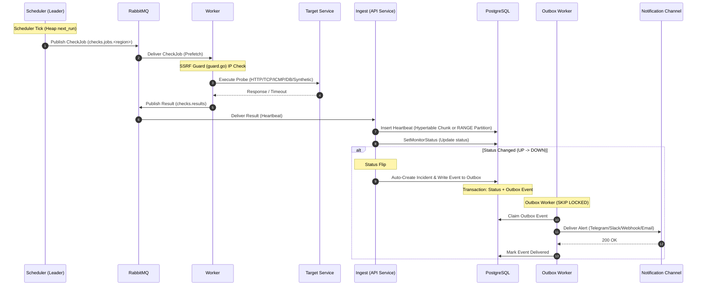
```mermaid
sequenceDiagram
    autonumber
    participant S as Scheduler (Leader)
    participant MQ as RabbitMQ
    participant W as Worker
    participant T as Target Service
    participant I as Ingest (API Service)
    participant DB as PostgreSQL
    participant OB as Outbox Worker
    participant N as Notification Channel

    Note over S: Scheduler Tick (Heap next_run)
    S->>MQ: Publish CheckJob (checks.jobs.<region>)
    MQ->>W: Deliver CheckJob (Prefetch)
    
    Note over W: SSRF Guard (guard.go) IP Check
    W->>T: Execute Probe (HTTP/TCP/ICMP/DB/Synthetic)
    T-->>W: Response / Timeout
    
    W->>MQ: Publish Result (checks.results)
    MQ->>I: Deliver Result (Heartbeat)
    
    I->>DB: Insert Heartbeat (Hypertable Chunk or RANGE Partition)
    I->>DB: SetMonitorStatus (Update status)
    
    alt Status Changed (UP -> DOWN)
        Note over I: Status Flip
        I->>DB: Auto-Create Incident & Write Event to Outbox
        Note over DB: Transaction: Status + Outbox Event
        
        Note over OB: Outbox Worker (SKIP LOCKED)
        OB->>DB: Claim Outbox Event
        OB->>N: Deliver Alert (Telegram/Slack/Webhook/Email)
        N-->>OB: 200 OK
        OB->>DB: Mark Event Delivered
    end
```

---

## 🌍 4. Geo-Distributed Monitoring Architecture

### 4.1 Mode A: AMQP Geo-Worker Pools (Direct AMQP Connection)

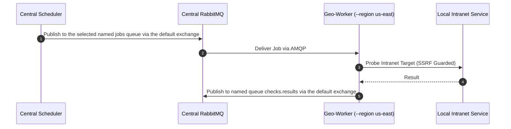
```mermaid
sequenceDiagram
    autonumber
    participant S as Central Scheduler
    participant MQ as Central RabbitMQ
    participant GW as Geo-Worker (--region us-east)
    participant Target as Local Intranet Service

    S->>MQ: Publish to the selected named jobs queue via the default exchange
    MQ->>GW: Deliver Job via AMQP
    GW->>Target: Probe Intranet Target (SSRF Guarded)
    Target-->>GW: Result
    GW->>MQ: Publish to named queue checks.results via the default exchange
```

### 💡 4.2 RabbitMQ Queue Families (Simplified)

cerbix publishes directly to named queues through RabbitMQ's default exchange (`exchange=""`,
the queue name as the routing key). It does not declare an application topic exchange or a
routing-key binding contract. The diagram is intentionally family-level; the canonical and
versioned queue names live in [`internal/dispatch/amqp.go`](../internal/dispatch/amqp.go).

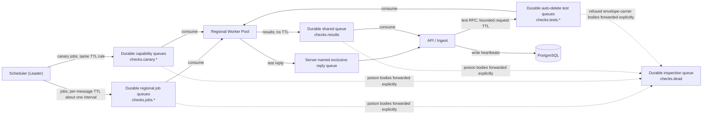
```mermaid
flowchart LR
    SCHED["Scheduler (Leader)"]
    API["API / Ingest"]
    WORKER["Regional Worker Pool"]

    JOBS["Durable regional job queues<br/>checks.jobs.*"]
    CANARY["Durable capability queues<br/>checks.canary.*"]
    TESTS["Durable auto-delete test queues<br/>checks.tests.*"]
    REPLY["Server-named exclusive reply queue"]
    RESULTS["Durable shared queue<br/>checks.results"]
    DEAD["Durable inspection queue<br/>checks.dead"]
    PG[("PostgreSQL")]

    SCHED -->|jobs; per-message TTL about one interval| JOBS
    SCHED -->|canary jobs; same TTL rule| CANARY
    API -->|test RPC; bounded request TTL| TESTS
    JOBS & CANARY -->|consume| WORKER
    TESTS -->|consume| WORKER
    WORKER -->|test reply| REPLY
    REPLY --> API
    WORKER -->|results; no TTL| RESULTS
    RESULTS -->|consume| API
    API -->|write heartbeats| PG
    JOBS & CANARY & RESULTS -. poison bodies forwarded explicitly .-> DEAD
    TESTS -. refused envelope-carrier bodies forwarded explicitly .-> DEAD
```

| Family | Current named queues | Lifecycle and routing fact |
| --- | --- | --- |
| Scheduled jobs | `checks.jobs.<region>`, `checks.jobs.v2.<region>`, `checks.jobs.v3.<region>`, `checks.jobs.v4.<region>` | Durable regional queues. The selected carrier generation follows executor capability; each job has a per-message TTL of approximately its monitor interval. |
| Async canary jobs | `checks.canary.<kind>@<version>.<region>`, `checks.canary.v3.<kind>@<version>.<region>` | Durable regional capability queues. An executor announces support by consuming the queue; jobs use the same interval-based TTL rule. |
| Test Connection | `checks.tests.<region>`, `checks.tests.v2.<region>`, `checks.tests.v3.<region>` | Durable, auto-delete regional request queues. Each RPC request has a bounded TTL and replies through a server-named, non-durable, exclusive, auto-delete queue. |
| Results | `checks.results` | Durable shared queue with no result TTL; slow ingest must not discard valid results. |
| Dead letter inspection | `checks.dead` | Durable shared queue. cerbix explicitly forwards poison job/result bodies and refused envelope-carrier test bodies; this is not a broker exchange/DLX contract. |

### 4.3 Mode B: HTTP Pull-Agent (Outbound HTTPS Only)

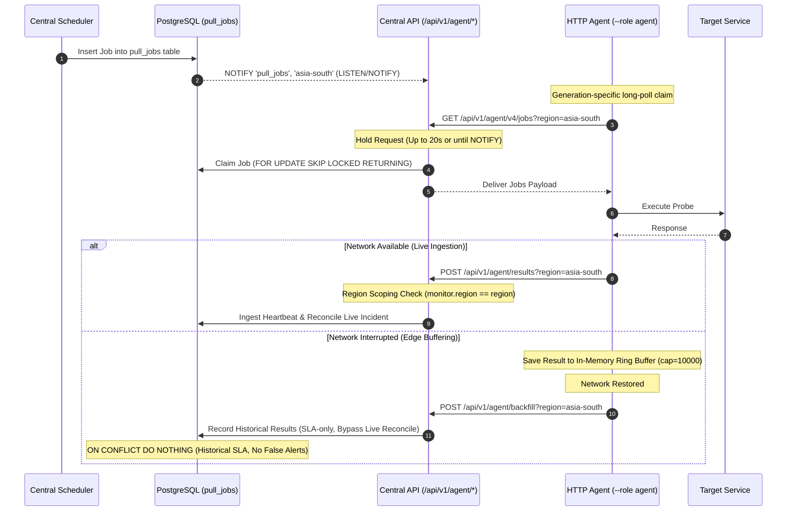
```mermaid
sequenceDiagram
    autonumber
    participant S as Central Scheduler
    participant DB as PostgreSQL (pull_jobs)
    participant API as Central API (/api/v1/agent/*)
    participant AG as HTTP Agent (--role agent)
    participant Target as Target Service

    S->>DB: Insert Job into pull_jobs table
    DB-->>API: NOTIFY 'pull_jobs', 'asia-south' (LISTEN/NOTIFY)
    
    Note over AG: Generation-specific long-poll claim
    AG->>API: GET /api/v1/agent/v4/jobs?region=asia-south
    Note over API: Hold Request (Up to 20s or until NOTIFY)
    API->>DB: Claim Job (FOR UPDATE SKIP LOCKED RETURNING)
    API-->>AG: Deliver Jobs Payload
    
    AG->>Target: Execute Probe
    Target-->>AG: Response
    
    alt Network Available (Live Ingestion)
        AG->>API: POST /api/v1/agent/results?region=asia-south
        Note over API: Region Scoping Check (monitor.region == region)
        API->>DB: Ingest Heartbeat & Reconcile Live Incident
    else Network Interrupted (Edge Buffering)
        Note over AG: Save Result to In-Memory Ring Buffer (cap=10000)
        Note over AG: Network Restored
        AG->>API: POST /api/v1/agent/backfill?region=asia-south
        API->>DB: Record Historical Results (SLA-only, Bypass Live Reconcile)
        Note over DB: ON CONFLICT DO NOTHING (Historical SLA, No False Alerts)
    end
```

The sequence shows the generation-4 job claim used by a ledger-capable current agent. The agent
selects the highest route it can consume and falls back across compatible generations during a
rolling upgrade. The complete HTTP-pull surface registered by `AgentRouter` is:

| Purpose | Method and route |
| --- | --- |
| Job claims, carrier generations 1–4 | `GET /api/v1/agent/jobs`, `GET /api/v1/agent/v2/jobs`, `GET /api/v1/agent/v3/jobs`, `GET /api/v1/agent/v4/jobs` |
| Live results and historical edge-buffer replay | `POST /api/v1/agent/results`, `POST /api/v1/agent/backfill` |
| Test Connection claims, carrier generations 1–3 | `GET /api/v1/agent/tests`, `GET /api/v1/agent/v2/tests`, `GET /api/v1/agent/v3/tests` |
| Test Connection result | `POST /api/v1/agent/test-results` |
| Liveness and capability announcement | `POST /api/v1/agent/heartbeat` |

---

## 🔐 5. Authentication & Tenant Authorization (AuthN & AuthZ)

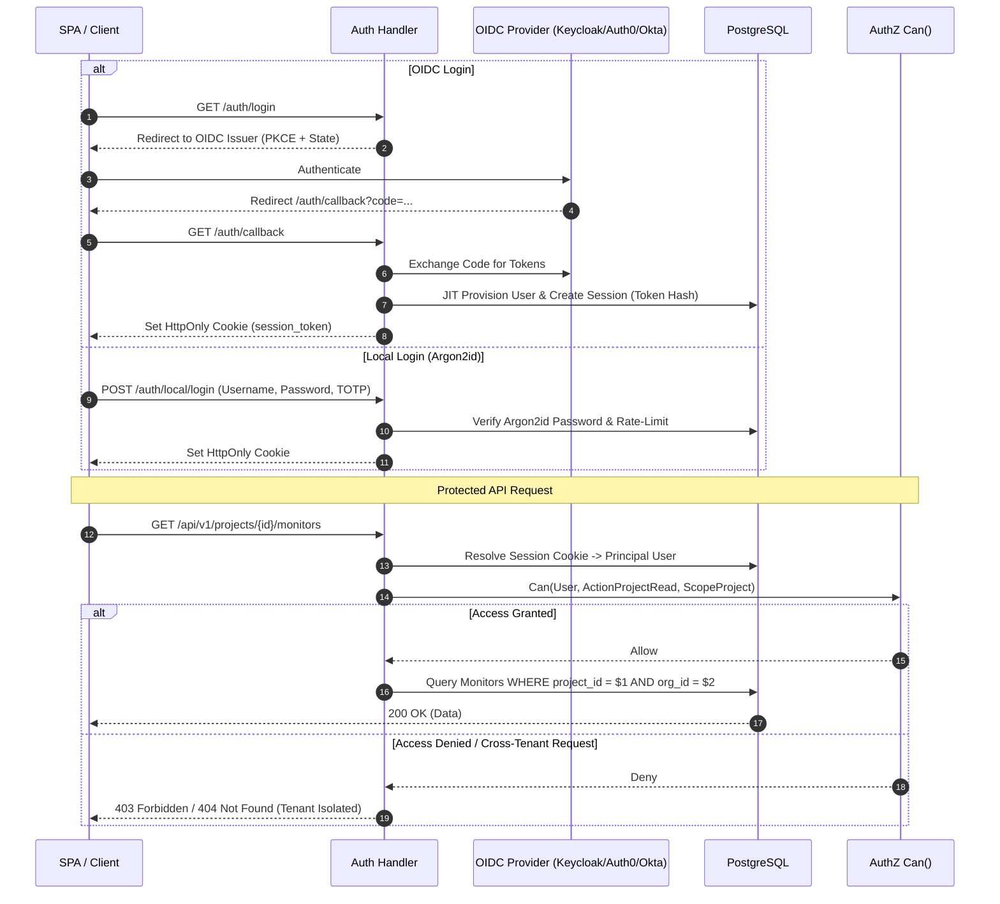
```mermaid
sequenceDiagram
    autonumber
    participant Client as SPA / Client
    participant Auth as Auth Handler
    participant IdP as OIDC Provider (Keycloak/Auth0/Okta)
    participant DB as PostgreSQL
    participant AuthZ as AuthZ Can()

    alt OIDC Login
        Client->>Auth: GET /auth/login
        Auth-->>Client: Redirect to OIDC Issuer (PKCE + State)
        Client->>IdP: Authenticate
        IdP-->>Client: Redirect /auth/callback?code=...
        Client->>Auth: GET /auth/callback
        Auth->>IdP: Exchange Code for Tokens
        Auth->>DB: JIT Provision User & Create Session (Token Hash)
        Auth-->>Client: Set HttpOnly Cookie (session_token)
    else Local Login (Argon2id)
        Client->>Auth: POST /auth/local/login (Username, Password, TOTP)
        Auth->>DB: Verify Argon2id Password & Rate-Limit
        Auth-->>Client: Set HttpOnly Cookie
    end

    Note over Client, AuthZ: Protected API Request
    Client->>Auth: GET /api/v1/projects/{id}/monitors
    Auth->>DB: Resolve Session Cookie -> Principal User
    Auth->>AuthZ: Can(User, ActionProjectRead, ScopeProject)
    
    alt Access Granted
        AuthZ-->>Auth: Allow
        Auth->>DB: Query Monitors WHERE project_id = $1 AND org_id = $2
        DB-->>Client: 200 OK (Data)
    else Access Denied / Cross-Tenant Request
        AuthZ-->>Auth: Deny
        Auth-->>Client: 403 Forbidden / 404 Not Found (Tenant Isolated)
    end
```

---

## 🚨 6. Escalations, On-Call & Incident Handling

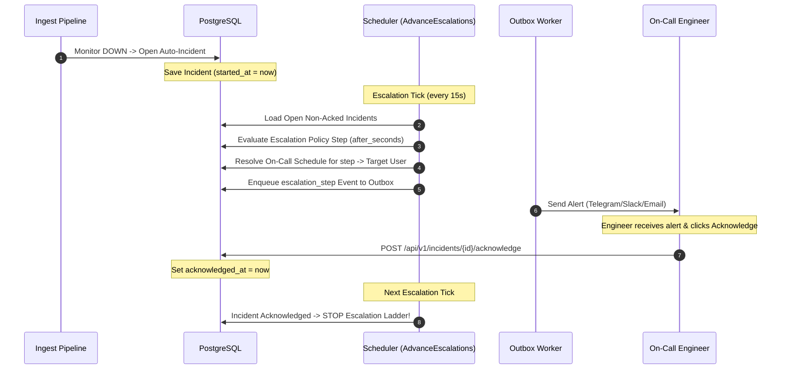
```mermaid
sequenceDiagram
    autonumber
    participant Ingest as Ingest Pipeline
    participant DB as PostgreSQL
    participant Sched as Scheduler (AdvanceEscalations)
    participant Outbox as Outbox Worker
    participant User as On-Call Engineer

    Ingest->>DB: Monitor DOWN -> Open Auto-Incident
    Note over DB: Save Incident (started_at = now)

    Note over Sched: Escalation Tick (every 15s)
    Sched->>DB: Load Open Non-Acked Incidents
    Sched->>DB: Evaluate Escalation Policy Step (after_seconds)
    Sched->>DB: Resolve On-Call Schedule for step -> Target User
    Sched->>DB: Enqueue escalation_step Event to Outbox

    Outbox->>User: Send Alert (Telegram/Slack/Email)
    
    Note over User: Engineer receives alert & clicks Acknowledge
    User->>DB: POST /api/v1/incidents/{id}/acknowledge
    Note over DB: Set acknowledged_at = now
    
    Note over Sched: Next Escalation Tick
    Sched->>DB: Incident Acknowledged -> STOP Escalation Ladder!
```

---

## 🗄️ 7. Database Entity-Relationship Diagram & Partitioning

* **Adaptive raw storage**: when TimescaleDB is installed, `heartbeats` is a hypertable with one-day chunks created on demand, native compression after seven days, and retention through `drop_chunks`. On plain PostgreSQL it uses declarative daily `RANGE (ts)` partitions plus `heartbeats_default`; the leader creates dated partitions and performs manual retention/default cleanup by dropping expired partitions and deleting expired rows stranded in the DEFAULT partition.
* **Heartbeat identity**: raw rows are idempotent under `UNIQUE (monitor_id, ts)`; `ts` is not a standalone primary key. `observed_at` keeps the raw probe/client observation time separately from the effective ordering timestamp `ts`.
* **Daily Rollup**: the scheduler leader maintains `heartbeats_daily` with `up` and `total` counts. The rollup schema and query semantics are the same in both raw-storage modes.

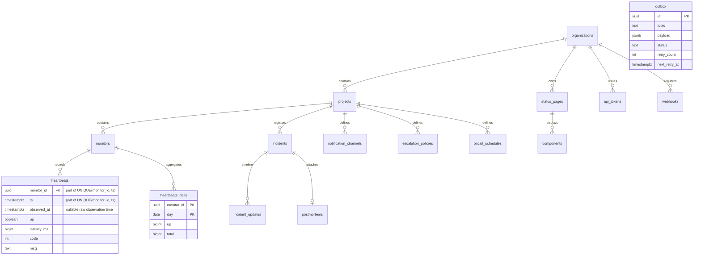
```mermaid
erDiagram
    organizations ||--o{ projects : contains
    projects ||--o{ monitors : contains
    projects ||--o{ incidents : registers
    projects ||--o{ notification_channels : defines
    projects ||--o{ escalation_policies : defines
    projects ||--o{ oncall_schedules : defines

    monitors ||--o{ heartbeats : records
    monitors ||--o{ heartbeats_daily : aggregates

    incidents ||--o{ incident_updates : timeline
    incidents ||--o| postmortems : attaches

    organizations ||--o{ status_pages : owns
    status_pages ||--o{ components : displays

    organizations ||--o{ api_tokens : issues
    organizations ||--o{ webhooks : registers

    heartbeats {
        uuid monitor_id FK "part of UNIQUE(monitor_id, ts)"
        timestamptz ts "part of UNIQUE(monitor_id, ts)"
        timestamptz observed_at "nullable raw observation time"
        boolean up
        bigint latency_ms
        int code
        text msg
    }

    heartbeats_daily {
        uuid monitor_id PK
        date day PK
        bigint up
        bigint total
    }

    outbox {
        uuid id PK
        text topic
        jsonb payload
        text status
        int retry_count
        timestamptz next_retry_at
    }
```

## 8. Current-domain partial ERD views

The diagrams below are **partial domain views**, not a complete database ERD. They document the
persisted relationships of the reliability subsystems that are easy to misread from the older core
ERD. `PK`, `UNIQUE`, `FK`, and nullable references are called out from the migrations; a logical
relationship is not presented as a foreign key when the schema deliberately does not have one.

### 8.1 Service reliability — partial domain view

Source of truth: [`00064_service_reliability.sql`](../internal/store/migrations/00064_service_reliability.sql),
[`00066_managed_services.sql`](../internal/store/migrations/00066_managed_services.sql),
[`00067_service_materialization_driver.sql`](../internal/store/migrations/00067_service_materialization_driver.sql),
[`00069_service_owner_tenancy.sql`](../internal/store/migrations/00069_service_owner_tenancy.sql),
[`00070_owner_fk_and_maintenance_provenance.sql`](../internal/store/migrations/00070_owner_fk_and_maintenance_provenance.sql),
[`00071_materialization_era.sql`](../internal/store/migrations/00071_materialization_era.sql),
[`00080_service_impact.sql`](../internal/store/migrations/00080_service_impact.sql),
[`00081_status_projection.sql`](../internal/store/migrations/00081_status_projection.sql),
[`00082_alerting_ownership.sql`](../internal/store/migrations/00082_alerting_ownership.sql),
[`00084_service_incidents.sql`](../internal/store/migrations/00084_service_incidents.sql),
[`00091_service_renotify.sql`](../internal/store/migrations/00091_service_renotify.sql),
the API wiring [`api.go`](../internal/api/api.go), and the service-reliability specification
[`func-service-reliability.md`](specs/func-service-reliability.md).

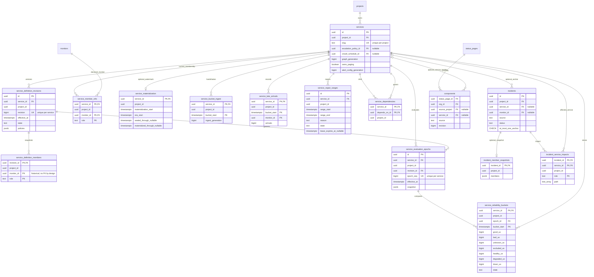
```mermaid
erDiagram
    projects ||--o{ services : owns
    services ||--o{ service_definition_revisions : versions
    service_definition_revisions ||--o{ service_definition_members : snapshots
    services ||--o{ service_member_refs : current_membership
    monitors ||--o{ service_member_refs : declared_monitor
    services ||--o{ service_evaluation_epochs : evaluates
    service_definition_revisions ||--o{ service_evaluation_epochs : governs
    service_evaluation_epochs ||--o{ service_reliability_buckets : computes
    services ||--o{ service_reliability_buckets : stores
    services ||--o| service_materialization : optional_watermark
    services ||--o{ service_bucket_ingest : handshakes
    services ||--o{ service_late_arrivals : records
    services ||--o{ service_repair_ranges : repairs
    services ||--o{ service_dependencies : child
    services ||--o{ service_dependencies : parent
    services o|--o{ incidents : optional_anchor
    incidents ||--o| incident_member_snapshots : optional_snapshot
    incidents ||--o{ incident_service_impacts : impact
    services ||--o{ incident_service_impacts : affected_service
    status_pages ||--o{ components : projects
    services o|--o{ components : optional_service_binding

    services {
        uuid id PK
        uuid project_id FK
        text slug UK "unique per project"
        uuid escalation_policy_id FK "nullable"
        uuid oncall_schedule_id FK "nullable"
        bigint graph_generation
        boolean owns_paging
        bigint alert_config_generation
    }
    service_definition_revisions {
        uuid id PK
        uuid service_id FK
        uuid project_id
        bigint revision UK "unique per service"
        timestamptz effective_at
        text state
        jsonb policies
    }
    service_definition_members {
        uuid revision_id PK, FK
        uuid project_id
        uuid monitor_id PK "historical; no FK by design"
        text role PK
    }
    service_member_refs {
        uuid service_id PK, FK
        uuid project_id
        uuid monitor_id PK, FK
        text role PK
    }
    service_evaluation_epochs {
        uuid id PK
        uuid service_id FK
        uuid project_id
        uuid revision_id FK
        bigint epoch_seq UK "unique per service"
        timestamptz effective_at
        jsonb snapshot
    }
    service_reliability_buckets {
        uuid service_id PK, FK
        uuid project_id
        uuid epoch_id FK
        timestamptz bucket_start PK
        bigint good_us
        bigint bad_us
        bigint unknown_us
        bigint excluded_us
        bigint healthy_us
        bigint degraded_us
        bigint down_us
        text state
    }
    service_materialization {
        uuid service_id PK, FK
        uuid project_id
        timestamptz materialization_start
        timestamptz era_start
        timestamptz sealed_through_nullable
        timestamptz materialized_through_nullable
    }
    service_bucket_ingest {
        uuid service_id PK, FK
        uuid project_id
        timestamptz bucket_start PK
        bigint ingest_generation
    }
    service_late_arrivals {
        uuid service_id PK, FK
        uuid project_id
        timestamptz bucket_start PK
        uuid monitor_id PK
        bigint arrivals
    }
    service_repair_ranges {
        uuid id PK
        uuid service_id FK
        uuid project_id
        timestamptz range_start
        timestamptz range_end
        text reason
        text state
        timestamptz lease_expires_at_nullable
    }
    service_dependencies {
        uuid service_id PK, FK
        uuid depends_on_id PK, FK
        uuid project_id
    }
    incidents {
        uuid id PK
        uuid project_id FK
        uuid service_id FK "nullable"
        uuid monitor_id FK "nullable"
        text source
        text status
        CHECK at_most_one_anchor
    }
    incident_member_snapshots {
        uuid incident_id PK, FK
        uuid project_id
        jsonb members
    }
    incident_service_impacts {
        uuid incident_id PK, FK
        uuid service_id PK, FK
        uuid project_id
        text role PK
        text_array path
    }
    components {
        uuid status_page_id FK
        uuid org_id FK
        uuid source_project FK "nullable"
        uuid service_id FK "nullable"
        text source
        bigint revision
    }
```

The raw reliability facts are not a second heartbeat table: `service_reliability_buckets` is a
monthly `RANGE (bucket_start)` table with a DEFAULT partition, with a composite primary key
`(service_id, bucket_start)` and a composite epoch FK. Historical definition members intentionally
retain `monitor_id` without a monitor FK; current `service_member_refs` is the live delete guard.
`service_materialization` owns the watermark/progress state, while `service_repair_ranges` owns durable
repair work. Status-page `components.service_id` is nullable and is active only when `source =
service`; the source project and page-scope constraints are separate persisted rules.

### 8.2 Reliability gate — partial domain view

Source of truth: [`00093_reliability_gate.sql`](../internal/store/migrations/00093_reliability_gate.sql),
[`00108_project_gate_policies.sql`](../internal/store/migrations/00108_project_gate_policies.sql),
[`00109_gate_policy_all_windows.sql`](../internal/store/migrations/00109_gate_policy_all_windows.sql),
and [`func-reliability-gate.md`](specs/func-reliability-gate.md),
[`func-project-gate-policy.md`](specs/func-project-gate-policy.md), and
[`func-reliability-gate-all-windows.md`](specs/func-reliability-gate-all-windows.md).

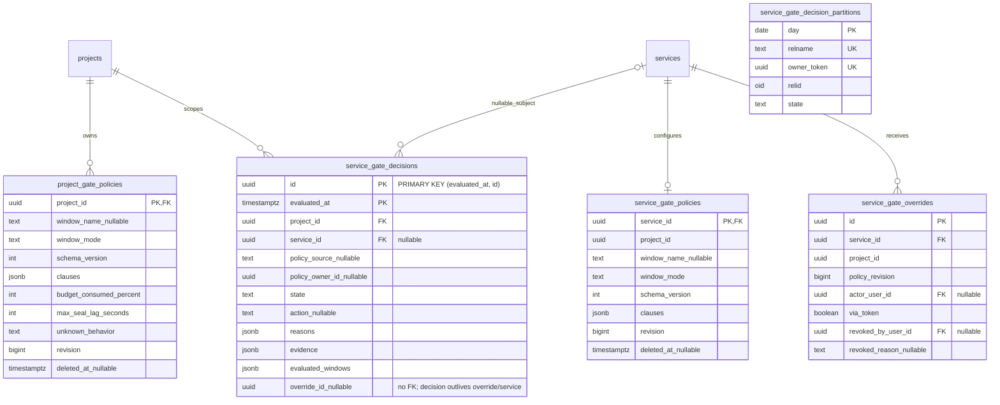
```mermaid
erDiagram
    projects ||--o{ project_gate_policies : owns
    services ||--o| service_gate_policies : configures
    services ||--o{ service_gate_overrides : receives
    projects ||--o{ service_gate_decisions : scopes
    services o|--o{ service_gate_decisions : nullable_subject

    project_gate_policies {
        uuid project_id PK, FK
        text window_name_nullable
        text window_mode
        int schema_version
        jsonb clauses
        int budget_consumed_percent
        int max_seal_lag_seconds
        text unknown_behavior
        bigint revision
        timestamptz deleted_at_nullable
    }
    service_gate_policies {
        uuid service_id PK, FK
        uuid project_id
        text window_name_nullable
        text window_mode
        int schema_version
        jsonb clauses
        bigint revision
        timestamptz deleted_at_nullable
    }
    service_gate_overrides {
        uuid id PK
        uuid service_id FK
        uuid project_id
        bigint policy_revision
        uuid actor_user_id FK "nullable"
        boolean via_token
        uuid revoked_by_user_id FK "nullable"
        text revoked_reason_nullable
    }
    service_gate_decisions {
        uuid id PK "PRIMARY KEY (evaluated_at, id)"
        timestamptz evaluated_at PK
        uuid project_id FK
        uuid service_id FK "nullable"
        text policy_source_nullable
        uuid policy_owner_id_nullable
        text state
        text action_nullable
        jsonb reasons
        jsonb evidence
        jsonb evaluated_windows
        uuid override_id_nullable "no FK; decision outlives override/service"
    }
    service_gate_decision_partitions {
        date day PK
        text relname UK
        uuid owner_token UK
        oid relid
        text state
    }
```

Policy revisions are generation columns on the service/project policy rows, not rows in a separate
revision table. The effective source (`service` or `project`) and owner are persisted on overrides and
non-`NOT_CONFIGURED` decisions; evaluated windows and evidence are JSONB on the immutable decision
row, not separate child tables. `service_gate_decisions` is partitioned by `evaluated_at`, has the
primary key `(evaluated_at, id)`, a per-partition `UNIQUE (id)`, and no DEFAULT partition. The
partition registry is the persisted ownership marker used by retention; `override_id`, `policy_owner_id`,
and `decision_id`-style historical references are deliberately not all foreign keys because the evidence
must remain readable after referenced policy/service/partition history changes.

### 8.3 Change intelligence — partial domain view

Source of truth: [`00094_change_intelligence.sql`](../internal/store/migrations/00094_change_intelligence.sql),
[`func-change-intelligence.md`](specs/func-change-intelligence.md), and the CLI implementation
[`change.go`](../internal/cli/change.go).

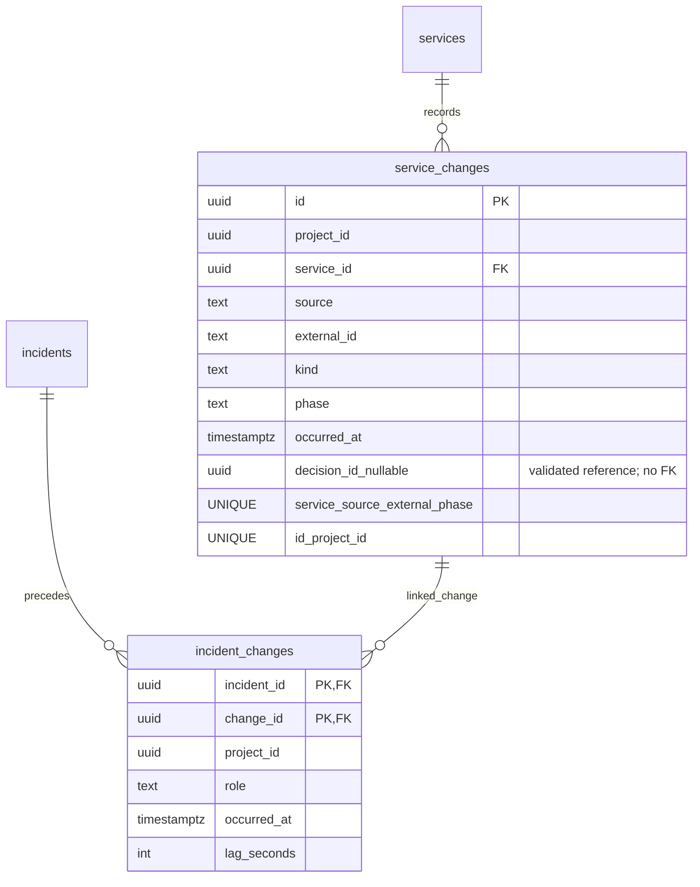
```mermaid
erDiagram
    services ||--o{ service_changes : records
    incidents ||--o{ incident_changes : precedes
    service_changes ||--o{ incident_changes : linked_change

    service_changes {
        uuid id PK
        uuid project_id
        uuid service_id FK
        text source
        text external_id
        text kind
        text phase
        timestamptz occurred_at
        uuid decision_id_nullable "validated reference; no FK"
        UNIQUE service_source_external_phase
        UNIQUE id_project_id
    }
    incident_changes {
        uuid incident_id PK, FK
        uuid change_id PK, FK
        uuid project_id
        text role
        timestamptz occurred_at
        int lag_seconds
    }
```

A change group is a logical identity `(service_id, source, external_id)`, not a persisted table. Each
phase is append-only and is protected by `UNIQUE (service_id, source, external_id, phase)`. The optional
gate decision reference is validated by the store but has no FK because gate partitions age out; incident
links copy the anchored phase time and lag and use composite tenant FKs to both endpoints.

### 8.4 Expected-run ledger — partial domain view

Source of truth: [`00102_expected_run_ledger.sql`](../internal/store/migrations/00102_expected_run_ledger.sql),
[`00103_expected_run_reservation.sql`](../internal/store/migrations/00103_expected_run_reservation.sql),
and [`func-expected-run-ledger.md`](specs/func-expected-run-ledger.md).

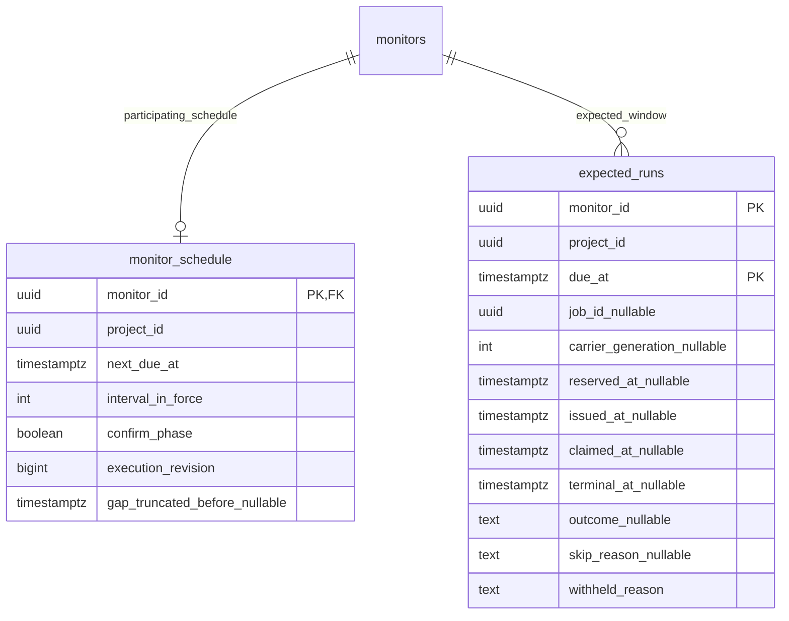
```mermaid
erDiagram
    monitors ||--o| monitor_schedule : participating_schedule
    monitors ||--o{ expected_runs : expected_window

    monitor_schedule {
        uuid monitor_id PK, FK
        uuid project_id
        timestamptz next_due_at
        int interval_in_force
        boolean confirm_phase
        bigint execution_revision
        timestamptz gap_truncated_before_nullable
    }
    expected_runs {
        uuid monitor_id PK
        uuid project_id
        timestamptz due_at PK
        uuid job_id_nullable
        int carrier_generation_nullable
        timestamptz reserved_at_nullable
        timestamptz issued_at_nullable
        timestamptz claimed_at_nullable
        timestamptz terminal_at_nullable
        text outcome_nullable
        text skip_reason_nullable
        text withheld_reason
    }
```

`expected_runs` is partitioned by `due_at` and has `expected_runs_default`; its identity is
`(monitor_id, due_at)`. `monitor_schedule` and `expected_runs` use composite monitor/project FKs and
there is no persisted FK or direct schema relation from the ledger to `heartbeats` or service reliability
facts: the ledger records expectation and execution state independently, while result correlation is
owned by the store/runtime paths. Retention creates/drops partitions and purges the DEFAULT partition;
there is no separate partition-ownership registry for this ledger.

### 8.5 Audit log — partial domain view

Source of truth: [`00018_audit_logs.sql`](../internal/store/migrations/00018_audit_logs.sql),
[`00047_admin_users.sql`](../internal/store/migrations/00047_admin_users.sql),
[`00107_audit_logs_retention_index.sql`](../internal/store/migrations/00107_audit_logs_retention_index.sql),
[`audit.go`](../internal/store/audit.go), and [`auditretention.go`](../internal/store/auditretention.go).

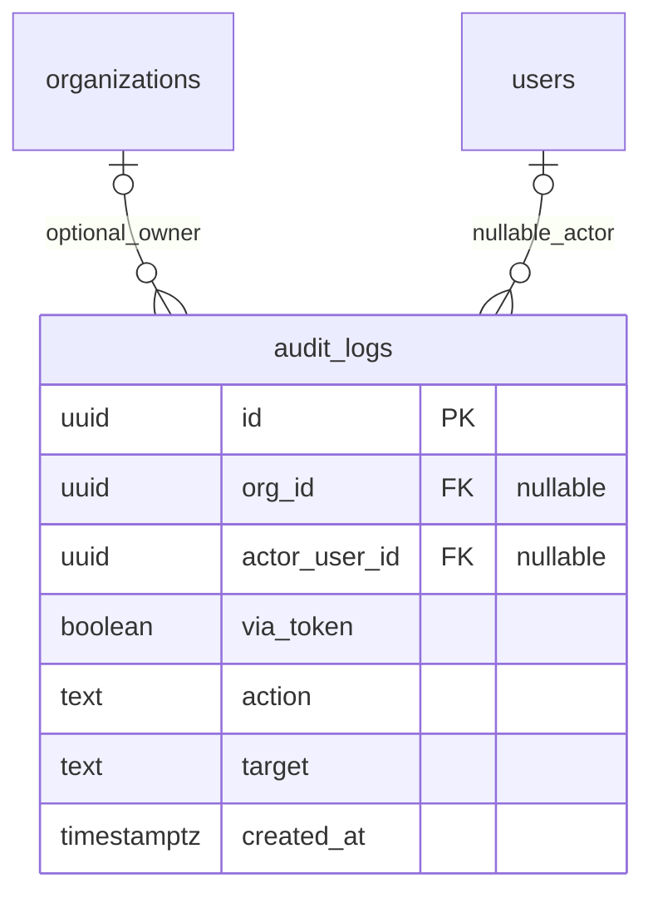
```mermaid
erDiagram
    organizations o|--o{ audit_logs : optional_owner
    users o|--o{ audit_logs : nullable_actor

    audit_logs {
        uuid id PK
        uuid org_id FK "nullable"
        uuid actor_user_id FK "nullable"
        boolean via_token
        text action
        text target
        timestamptz created_at
    }
```

`audit_logs.org_id` is nullable: organization-scoped entries cascade with their organization, while
instance-level global-admin entries have no organization parent. `actor_user_id` is nullable and uses
`ON DELETE SET NULL`, so the actor label is not a hard historical dependency. Gate policy/override,
incident, monitor, and other principal writes use this same organization-or-instance audit log; the
target is text rather than a foreign-key graph. Migration `00107` adds the retention index only; it does
not add another audit entity or a persisted relation to the audited object.
